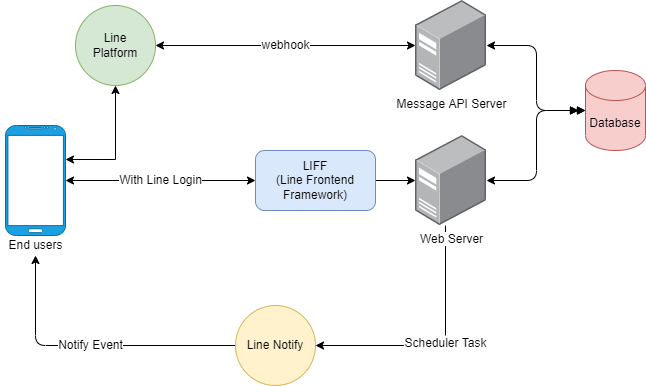

# Activity Bot
## Introduction
這是一個可以管理群組或個人活動的LineBot，可以個人使用或是群組使用(兩人使用情況還在思考中)。

## System Architecture



## Motivation
當想要跟群組內的朋友約聚餐或約出去玩的時候，或是有一些重要活動(e.g. 搶票、作業Deadline)需要特別紀錄的時候，Line現有的功能似乎無法做到**設定一個事件，並且時間快到前通知**這件事情。

因此，我決定試著設計一個簡單的Line bot來做到這件事情，讓使用者可以將Bot邀至群組，透過與他互動來建立新事件，並且此Bot會在時間快到提醒使用者。

## System Workflow


## Bot Command
- @我要辦活動!: 
    
    功用: Bot回覆一個可以新增活動的連結(LIFF網址)
- @顯示活動-[活動名稱]:

    功用: Bot回覆活動詳細資訊，可點選參加以及查看活動詳情(活動名稱、目前參加者等等)

    

## Get started
 
[](https://heroku.com/deploy)

or
```
git clone https://github.com/cyctw/Activity-bot && cd Activity-bot
```

```
go mod tidy
go run cmd/app/server.go
```
### Line Notify
User可以選擇要在哪個群組(or 個人)通知我
### Deploy on Heroku

## TODO
## Design Problem
### LIFF and bot communication
如果要與Bot進行較複雜的溝通(e.g. 辦活動，需要提交名稱、時間、地點)，會使用LIFF建構一個簡單的小頁面讓使用者填寫，填寫完成後再發Request給後端。但是這樣做因為使用者沒有在Line上面傳送任何訊息，所以Bot 無法回應使用者 (除非使用push message)。雖然使用LIFF的API，可以做到自動幫使用者傳送訊息，但因為Bot要辨識出此訊息對應到哪個事件，因此該訊息要包含事件的相關訊息。

舉例來說，使用者想要舉辦活動，在填寫完LIFF上的表單後，後端接收到Request並成功建立活動。但此時為了要與Bot有互動(希望舉辦的活動能透過Bot傳送到群組給大家看)，使用者必須傳送訊息且該訊息**包含此活動的unique的特徵**，後端才能辨識出該訊息對應到哪個活動。(E.g. 訊息:"我要舉辦活動, ID: 3" 或是 "我要舉辦活動 '約吃飯'" )
### 