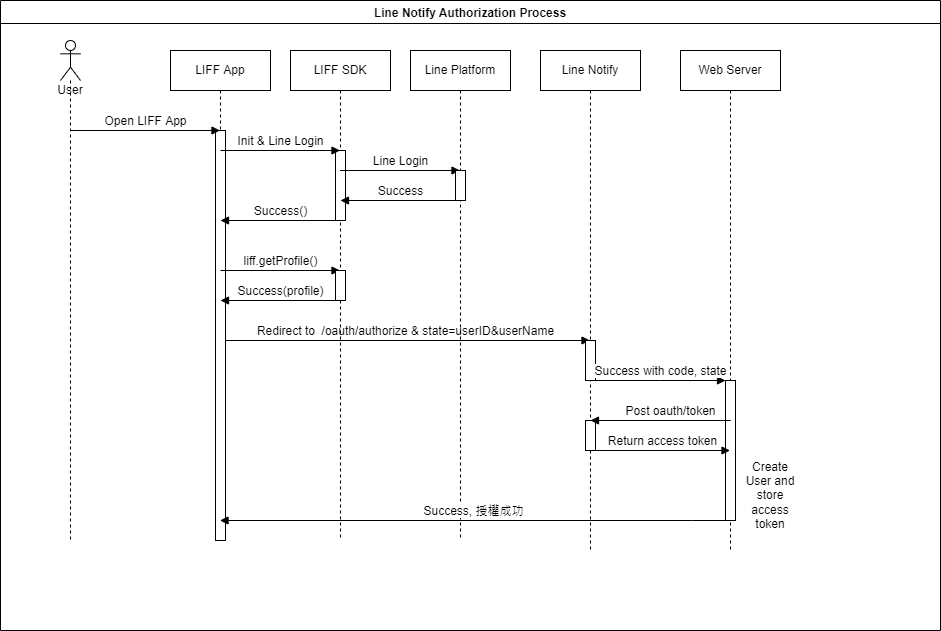
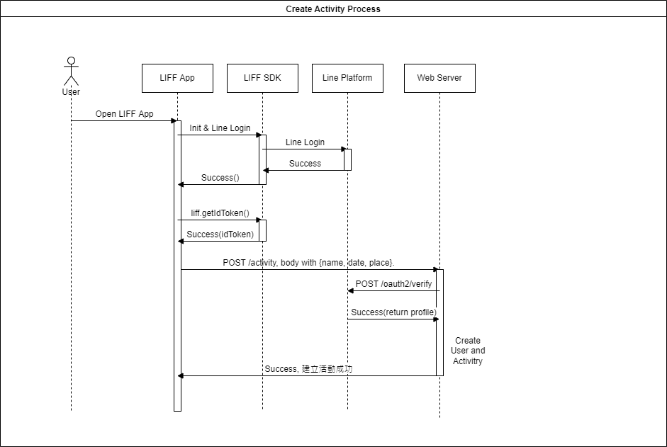
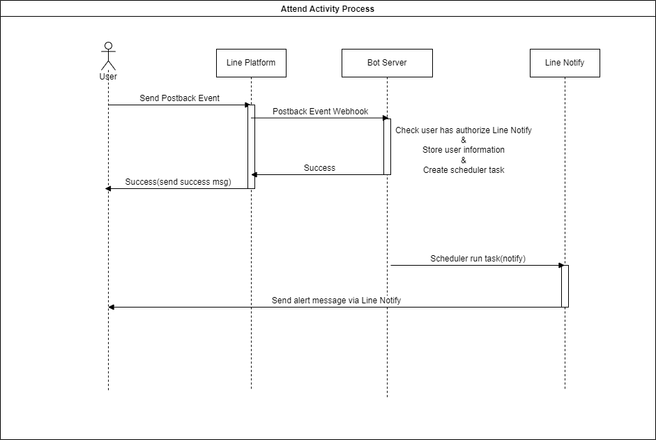

# Activity-LineBot


## Introduction
這是一個可以管理群組或個人活動的LineBot，主要的功能為兩個: **建立事件跟參與事件。**

要參與事件前要先透過LineBot建立事件。接著，透過參與事件，在事件快到之前Line Notify會提醒所有事件參加者。依據使用情況可以分為個人使用或是群組使用(兩人使用情況還在思考中)。

- **群組使用情形:**

    將Bot邀至群組內，可以透過與Bot互動建立活動，並且可以參與他人建立的活動。隨時可以透過Bot查看活動內容，並且查看參加者有誰。在活動快到之前，系統會透過Line Notify發送提醒給參加者。

- **個人使用情形**
    
    直接與Bot進行互動，建立自己的活動並自己參加，時間快到時一樣會有通知。
## QRCode


- [Demo Video](https://youtu.be/sLSR_3cIwp8)
## System Architecture


## Motivation
當想要跟群組內的朋友約聚餐或約出去玩的時候，或是有一些重要活動(e.g. 搶票、作業Deadline)需要特別紀錄的時候，Line現有的功能似乎無法做到**設定一個事件，並且時間快到前通知**這件事情。

因此，我決定試著設計一個簡單的Line bot來做到這件事情，讓使用者可以將Bot邀至群組，透過與他互動來建立新事件，並且此Bot會在時間快到提醒使用者。


## Bot Command
- @我要辦活動
    
    功用: Bot回覆一個可以新增活動的連結(LIFF網址)
- @顯示活動-[活動名稱]

    功用: Bot回覆活動詳細資訊，可點選參加以及查看活動詳情(活動名稱、目前參加者等等)
- @注意事項
    
    功用: Bot回覆歡迎訊息內的注意事項。E.g. 需先加好友、授權通知等等。
## System Workflow
**授權通知流程**

**舉辦活動流程**

**參加活動流程**



## How to run this bot locally or in cloud?
### Prerequisite
此Bot主要用到了三種Line的服務，因此如果要在自己電腦運行(或是放到Heroku上面)，需要先註冊一些服務帳號，如以下所述。
- 註冊Line Message API Account

    可以參考[官方文件](https://developers.line.biz/zh-hant/docs/messaging-api/getting-started/)。

    > 註冊完後會獲得
    > - `CHANNEL_SECRET`
    > - `CHANNEL_ACCESS_TOKEN`
- 註冊Line Login Account *(用來啟用LIFF)*

    可以參考[官方文件](https://developers.line.biz/en/docs/liff/registering-liff-apps/)。

    > 註冊完後會獲得
    > - `LINE_LOGIN_CHANNEL_ID`
    > - `LIFF_ID`
    > - `LIFF_URL`

- 註冊Line Notify

    可以參考Line Notify [官方文件](https://notify-bot.line.me/doc/en/)。

    > 註冊完會獲得
    > - `LINE_NOTIFY_CLIENT_ID`
    > - `LINE_NOTIFY_CLIENT_SECRET`
    > - `LINE_NOTIFY_REDIRECT_URI`

    `LINE_NOTIFY_REDIRECT_URI` 這個值要填寫: 預計部屬至的網站URL + `/notify`。
    
    E.g. `https://activity-linebot.herokuapp.com/notify`

---
### Build on cloud (heroku)
直接點選以下按鈕可以直接部屬至Heroku上面，部屬前要先填寫以上註冊的環境變數。比較需要特別注意的是`LINE_NOTIFY_REDIRECT_URI`。

假設Heroku app name叫做`actibity-bot-2022`，這樣`LINE_NOTIFY_REDIRECT_URI`就要填入`https://actibity-bot-2022.herokuapp.com/notify`，且此值需跟Line Notify上面的URL要一樣。


[](https://heroku.com/deploy)

### Build locally
**Clone and move to workplace**
```
git clone https://github.com/cyctw/Activity-bot && cd Activity-bot
```
**Set up Environment variable**

為了方便，可以建立一個`.sh`檔案，並且加入下列幾行
```
#!/bin/sh
export CHANNEL_ACCESS_TOKEN=<Your token>
export CHANNEL_SECRET=<Your Secret>
export DATABASE_URL=<Your Database URL>
...
```
接著跑`source <your-script>.sh`來Export 環境變數

**Build frontend(LIFF) page**
```
cd cmd/nextjs
yarn install
yarn build
```
Build好的 Static files 會放在`cmd/nextjs/out`。

**Build backend and run code**
```
go run cmd/app/server.go
```

## TODO
- 動態調整提醒時間
    > 可能需新增參加活動頁面，並且可選擇提醒時間
- 移除參加，移除整個事件
- 更改事件內容
    > (若更改到活動時間，需要更改scheduler task)
- 更改DB Table架構，讓每個Activity 在不同群組之間是分開的

## Design Problem
### LIFF and bot communication
如果要與Bot進行較複雜的溝通(e.g. 辦活動，需要提交名稱、時間、地點)，會使用LIFF建構一個簡單的小頁面讓使用者填寫，填寫完成後再發Request給後端。但是這樣做因為使用者沒有在Line上面傳送任何訊息，所以Bot 無法回應使用者 (除非使用push message)。雖然使用LIFF的API，可以做到自動幫使用者傳送訊息，但因為Bot要辨識出此訊息對應到哪個事件，因此該訊息要包含事件的相關訊息。

舉例來說，使用者想要舉辦活動，在填寫完LIFF上的表單後，後端接收到Request並成功建立活動。但此時為了要與Bot有互動(希望舉辦的活動能透過Bot傳送到群組給大家看)，使用者必須傳送訊息且該訊息**包含此活動的unique的特徵**，後端才能辨識出該訊息對應到哪個活動。(E.g. 訊息:"我要舉辦活動, ID: 3" 或是 "我要舉辦活動 '約吃飯'" )
### Line Notify
使用者在開啟授權通知時，可以選擇要在哪個群組(or 個人)通知我。不確定是否可以確認使用者選擇哪個選項(Line notify 只會回傳code跟state，但state是自己設的)。

可能造成的問題為，若多個參加使用者都選擇在群組通知，則會造成提醒時間到時有大量訊息在群組洗版出現。